# Migration Guide: v3.17.0 → v4.0.0

**From:** COINjecture v3.17.0 (Python monolith)
**To:** COINjecture v4.0.0 (Multi-language refactor)
**Migration Complexity:** Medium
**Estimated Time:** 2-4 hours (depending on customizations)
**Backwards Compatibility:** Full (with feature flags)

---

## Table of Contents

1. [Overview](#overview)
2. [Breaking Changes](#breaking-changes)
3. [Migration Strategies](#migration-strategies)
4. [Step-by-Step Migration](#step-by-step-migration)
5. [Configuration Changes](#configuration-changes)
6. [API Changes](#api-changes)
7. [Data Migration](#data-migration)
8. [Testing & Validation](#testing--validation)
9. [Rollback Procedures](#rollback-procedures)
10. [FAQ](#faq)

---

## Overview

### What's New in v4.0.0?

COINjecture v4.0.0 represents a **complete architectural refactor** with institutional-grade quality:

**🔧 Architecture:**
- **Rust Core** - Consensus-critical logic (deterministic, no panics)
- **Go Daemon** - Operational layer (API, P2P, IPFS, rate limiting)
- **Python Shims** - Backwards compatibility with legacy code

**🔒 Security Enhancements:**
- **SEC-002:** Enhanced epoch replay protection with HMAC commitment binding
- **SEC-005:** IPFS pinning quorum (≥2/3 nodes required)
- 6-layer defense-in-depth architecture

**📊 Observability:**
- 15 SLOs with error budgets
- 50+ Prometheus alerts
- 3 Grafana dashboards

**🚀 Performance:**
- 30% faster block validation (Desktop tier)
- 25% faster header hashing
- 14% lower memory usage

### Why Migrate?

✅ **Security:** Critical fixes for epoch replay and IPFS integrity
✅ **Performance:** Significant speed improvements across all tiers
✅ **Reliability:** Production-hardened with institutional-grade testing
✅ **Future-Proof:** Foundation for upcoming features (smart contracts, sharding)

### Migration Overview

```mermaid
flowchart TB
    START[v3.17.0 Running] --> BACKUP[Backup Data<br/>& Config]
    BACKUP --> CHOOSE{Choose Strategy}

    CHOOSE -->|Zero Downtime| SHADOW[Shadow Mode<br/>Dual-Run Validation]
    CHOOSE -->|Planned Downtime| DIRECT[Direct Upgrade<br/>Stop & Replace]

    SHADOW --> DEPLOY_NEW[Deploy v4.0.0<br/>codec_mode: shadow]
    DEPLOY_NEW --> MONITOR[Monitor Parity<br/>100% Match Required]
    MONITOR --> VALIDATE{Parity OK?}

    VALIDATE -->|Yes| CUTOVER[Gradual Cutover<br/>10% → 100%]
    VALIDATE -->|No| DEBUG[Debug Drift<br/>Fix Issues]
    DEBUG --> MONITOR

    CUTOVER --> VERIFY[Verify Production<br/>7-Day Soak Test]

    DIRECT --> STOP[Stop v3.17.0]
    STOP --> MIGRATE_DATA[Migrate Data<br/>Run Migration Script]
    MIGRATE_DATA --> START_NEW[Start v4.0.0<br/>codec_mode: refactored_only]
    START_NEW --> VERIFY

    VERIFY --> COMPLETE[Migration Complete ✅]

    style START fill:#f4a261,stroke:#333
    style COMPLETE fill:#06d6a0,stroke:#333
    style SHADOW fill:#118ab2,stroke:#333
    style DIRECT fill:#e63946,stroke:#333
```



---

## Breaking Changes

### 1. Configuration File Format

**v3.17.0 (INI format):**
```ini
[network]
p2p_port = 4001
api_port = 8080

[consensus]
tier = desktop
```

**v4.0.0 (YAML format):**
```yaml
network:
  p2p_port: 4001
  api_port: 8080

consensus:
  hardware_tier: desktop
  codec_mode: refactored_only
```

**Migration:** Use provided conversion script:
```bash
./scripts/migrate-config.sh v3-config.ini v4-config.yaml
```

---

### 2. API Endpoint Changes

| v3.17.0 Endpoint | v4.0.0 Endpoint | Notes |
|------------------|-----------------|-------|
| `/blocks?height=123` | `/api/v1/blocks/123` | RESTful path params |
| `/submit_block` | `/api/v1/blocks` (POST) | Standard HTTP methods |
| `/peer_list` | `/api/v1/network/peers` | Namespaced under `/network` |
| `/balance/<addr>` | `/api/v1/accounts/<addr>/balance` | More explicit naming |

**Migration:** Update API clients to use v4 endpoints. v3 endpoints deprecated but supported until v5.0.0.

---

### 3. Binary Format Changes

**Block Encoding:**
- v3.17.0: msgpack (non-canonical)
- v4.0.0: msgpack (canonical, strict decode)

**Impact:** Blocks encoded by v3 can be read by v4, but v4 blocks may not decode correctly in v3.

**Migration:** Rebuild blockchain from genesis OR use migration tool to re-encode blocks.

---

### 4. Database Schema Changes

**v3.17.0:**
- SQLite database
- Schema: `blocks`, `transactions`, `accounts`

**v4.0.0:**
- RocksDB database (faster, more scalable)
- Schema: Extended with `ipfs_pins`, `epoch_replay_cache`

**Migration:** Automatic via `coinjectured migrate-db` command.

---

### 5. Removed Features

| Feature | v3.17.0 | v4.0.0 | Alternative |
|---------|---------|--------|-------------|
| **SQLite Support** | ✅ | ❌ | Use RocksDB (migration provided) |
| **Legacy Codec (v0)** | ✅ | ❌ | Codec v1 only |
| **JSON-RPC** | ✅ | ❌ | Use REST API |
| **HTTP Basic Auth** | ✅ | ❌ | Use API Keys |

---

## Migration Strategies

### Strategy 1: Shadow Mode (Zero Downtime) ⭐ Recommended

**Best For:**
- Production environments
- Risk-averse deployments
- Need to validate before full cutover

**Timeline:** 7-14 days

**Process:**
1. Deploy v4.0.0 alongside v3.17.0
2. Run in `shadow` mode (both codecs execute, compare results)
3. Monitor parity match rate (must be 100%)
4. Gradually cut over traffic
5. Decommission v3.17.0

**Pros:**
✅ Zero downtime
✅ Validates correctness before cutover
✅ Easy rollback

**Cons:**
❌ Requires duplicate infrastructure
❌ Longer migration timeline

---

### Strategy 2: Direct Upgrade (Planned Downtime)

**Best For:**
- Development/staging environments
- Acceptable downtime window
- Smaller datasets

**Timeline:** 2-4 hours

**Process:**
1. Schedule maintenance window
2. Stop v3.17.0
3. Backup data
4. Run migration scripts
5. Start v4.0.0
6. Validate functionality

**Pros:**
✅ Simpler process
✅ No duplicate infrastructure
✅ Faster completion

**Cons:**
❌ Downtime required (typically 1-2 hours)
❌ Higher rollback complexity

---

### Strategy 3: Fresh Sync (Clean Start)

**Best For:**
- Non-critical nodes
- Corrupted v3 data
- Want to verify sync from genesis

**Timeline:** Variable (depends on blockchain size)

**Process:**
1. Deploy v4.0.0 on new infrastructure
2. Sync from genesis
3. Switch over once synced
4. Decommission v3.17.0

**Pros:**
✅ Clean state, no legacy baggage
✅ Validates full sync capability

**Cons:**
❌ Long sync time (hours to days)
❌ Bandwidth intensive

---

## Step-by-Step Migration

### Strategy 1: Shadow Mode Migration (Detailed)

#### Phase 1: Preparation (Day 1)

**1. Backup v3.17.0 Data**

```bash
# Stop v3 node (if using direct upgrade) or leave running (shadow mode)
# For shadow mode, leave it running

# Backup blockchain data
tar -czf coinjecture-v3-backup-$(date +%Y%m%d).tar.gz \
  ~/.coinjecture/v3/

# Backup config
cp ~/.coinjecture/config.ini ~/coinjecture-v3-config.ini.backup

# Verify backup integrity
tar -tzf coinjecture-v3-backup-*.tar.gz | head
```

**2. Install v4.0.0**

```bash
# Download v4.0.0 release
wget https://github.com/Quigles1337/COINjecture1337-REFACTOR/releases/download/v4.0.0/coinjectured-v4.0.0-x86_64-linux

# Verify signature (see RELEASE_POLICY.md)
wget https://github.com/.../coinjectured-v4.0.0-x86_64-linux.bundle
cosign verify-blob --bundle coinjectured-v4.0.0-x86_64-linux.bundle ...

# Install
chmod +x coinjectured-v4.0.0-x86_64-linux
sudo mv coinjectured-v4.0.0-x86_64-linux /usr/local/bin/coinjectured-v4

# Verify installation
coinjectured-v4 --version
# Expected: coinjectured v4.0.0
```

**3. Convert Configuration**

```bash
# Use migration script
./scripts/migrate-config.sh \
  ~/.coinjecture/config.ini \
  ~/.coinjecture/config-v4.yaml

# Review generated config
cat ~/.coinjecture/config-v4.yaml

# IMPORTANT: Set codec_mode to "shadow"
nano ~/.coinjecture/config-v4.yaml
```

**Edit config-v4.yaml:**
```yaml
consensus:
  codec_mode: shadow  # Run both legacy and refactored, compare results
  hardware_tier: desktop
```

---

#### Phase 2: Deploy Shadow Mode (Day 1-2)

**1. Start v4.0.0 in Shadow Mode**

```bash
# Start v4 daemon
coinjectured-v4 start --config ~/.coinjecture/config-v4.yaml

# Expected output:
# [INFO] COINjecture v4.0.0 starting...
# [INFO] Codec mode: shadow
# [INFO] Dual-run validation enabled
# [INFO] Legacy codec: Python (v3.17.0)
# [INFO] Refactored codec: Rust (v4.0.0)
# [INFO] P2P listening on 0.0.0.0:4001
# [INFO] API listening on 0.0.0.0:8080
```

**2. Monitor Parity Validation**

```bash
# Check parity match rate (MUST be 100%)
curl http://localhost:8080/api/v1/metrics | grep dual_run_parity_match_rate

# Expected:
# dual_run_parity_match_rate 1.0

# Check for any mismatches (should be 0)
curl http://localhost:8080/api/v1/metrics | grep dual_run_mismatches_total

# Expected:
# dual_run_mismatches_total 0
```

**3. Dashboard Monitoring**

Open Grafana dashboard: http://localhost:3000

Navigate to: **COINjecture - Parity Validation**

Watch for:
- **Parity Match Rate:** Must stay at 100%
- **Mismatch Events:** Should be zero
- **Speedup Factor:** Rust should be 2-10x faster

**If mismatch detected:**
```bash
# Check logs for details
sudo journalctl -u coinjectured-v4 | grep "parity mismatch"

# Output will show which function mismatched
# [ERROR] Parity mismatch detected: function=compute_header_hash
#   Legacy result:  0xabc123...
#   Refactored result: 0xdef456...

# Report bug: https://github.com/Quigles1337/COINjecture1337-REFACTOR/issues
```

---

#### Phase 3: Soak Test (Day 2-7)

**Run shadow mode for 7 days** to ensure stability:

**Daily Checks:**
```bash
# Day 1-7: Check parity status
./scripts/check-migration-health.sh

# Script output:
# ✅ Parity match rate: 100% (target: 100%)
# ✅ Uptime: 24h 15m
# ✅ No validation errors
# ✅ Memory usage: 980MB (budget: 1GB)
# ✅ P2P peers: 12 connected
```

**Performance Comparison:**
```bash
# Compare performance metrics
curl http://localhost:8080/api/v1/metrics | grep 'dual_run.*duration'

# Example output:
# dual_run_legacy_duration_seconds{quantile="0.95"} 0.342
# dual_run_refactored_duration_seconds{quantile="0.95"} 0.125

# Speedup: 0.342 / 0.125 = 2.7x faster! 🚀
```

---

#### Phase 4: Gradual Cutover (Day 8-14)

**Cutover Timeline:**


**Day 8: 10% Traffic**

Edit config:
```yaml
consensus:
  codec_mode: refactored_primary  # Rust primary, Python fallback
  rollout_percentage: 10           # 10% of operations use Rust
```

Restart:
```bash
sudo systemctl restart coinjectured-v4

# Monitor for 24 hours
# If issues: rollback to shadow mode
```

**Day 9: 25% Traffic**
```yaml
rollout_percentage: 25
```

**Day 10: 50% Traffic**
```yaml
rollout_percentage: 50
```

**Day 11: 75% Traffic**
```yaml
rollout_percentage: 75
```

**Day 12: 100% Traffic**
```yaml
consensus:
  codec_mode: refactored_only  # Pure Rust, legacy removed
```

---

#### Phase 5: Cleanup (Day 13+)

**1. Decommission v3.17.0**

```bash
# Stop v3 daemon
sudo systemctl stop coinjecture-v3

# Disable auto-start
sudo systemctl disable coinjecture-v3

# Archive v3 data (keep for 30 days)
mkdir -p ~/coinjecture-archive
mv ~/.coinjecture/v3 ~/coinjecture-archive/v3-$(date +%Y%m%d)

# Remove v3 binary (optional)
sudo rm /usr/local/bin/coinjectured-v3
```

**2. Update Default to v4**

```bash
# Make v4 the default
sudo ln -sf /usr/local/bin/coinjectured-v4 /usr/local/bin/coinjectured

# Update systemd service
sudo cp /etc/systemd/system/coinjectured-v4.service \
        /etc/systemd/system/coinjectured.service

sudo systemctl daemon-reload
sudo systemctl enable coinjectured
```

**3. Final Validation**

```bash
# Run full validation suite
coinjectured verify-chain --data-dir ~/.coinjecture/data

# Expected output:
# Verifying blockchain integrity...
# ✅ Verified 12345 blocks
# ✅ All commitments valid
# ✅ All IPFS pins verified (quorum ≥2/3)
# ✅ State hash matches: 0xfinal...
#
# Verification complete: No errors found
```

---

### Strategy 2: Direct Upgrade Migration

#### Step 1: Pre-Migration Checklist

- [ ] Maintenance window scheduled (2-4 hours)
- [ ] Stakeholders notified
- [ ] Backup completed and verified
- [ ] Rollback plan documented
- [ ] v4.0.0 binary downloaded and verified

#### Step 2: Stop v3.17.0

```bash
# Stop daemon
sudo systemctl stop coinjecture

# Verify stopped
ps aux | grep coinjecture
# Should return no processes
```

#### Step 3: Migrate Database

```bash
# Run database migration
coinjectured-v4 migrate-db \
  --from ~/.coinjecture/v3/blockchain.db \
  --to ~/.coinjecture/v4/data

# Expected output:
# [INFO] Starting database migration...
# [INFO] Source: SQLite (~/.coinjecture/v3/blockchain.db)
# [INFO] Target: RocksDB (~/.coinjecture/v4/data)
# [INFO] Migrating 12345 blocks...
# [PROGRESS] 25% (3086 blocks)
# [PROGRESS] 50% (6172 blocks)
# [PROGRESS] 75% (9258 blocks)
# [PROGRESS] 100% (12345 blocks)
# [INFO] Re-encoding blocks with canonical codec...
# [INFO] Building epoch replay cache...
# [INFO] Verifying IPFS CIDs...
# [INFO] Migration complete! (took 45m 23s)
```

#### Step 4: Update Configuration

```bash
# Convert config
./scripts/migrate-config.sh \
  ~/.coinjecture/config.ini \
  ~/.coinjecture/config-v4.yaml

# Set codec mode to refactored_only (no legacy fallback)
echo "consensus:
  codec_mode: refactored_only
  hardware_tier: desktop" >> ~/.coinjecture/config-v4.yaml
```

#### Step 5: Start v4.0.0

```bash
# Update systemd service to use v4
sudo nano /etc/systemd/system/coinjecture.service

# Change:
# ExecStart=/usr/local/bin/coinjectured start ...
# To:
# ExecStart=/usr/local/bin/coinjectured-v4 start --config /etc/coinjecture/config-v4.yaml

# Reload and start
sudo systemctl daemon-reload
sudo systemctl start coinjecture

# Check status
sudo systemctl status coinjecture
```

#### Step 6: Post-Migration Validation

```bash
# Check node status
curl http://localhost:8080/api/v1/status

# Expected:
# {
#   "version": "4.0.0",
#   "sync_status": "synced",
#   "block_height": 12345,
#   "peer_count": 8
# }

# Verify first 100 blocks
coinjectured-v4 verify-chain --start 0 --limit 100

# Mine a test block (if miner)
coinjectured-v4 mine --test-mode

# Check logs for errors
sudo journalctl -u coinjecture -n 100 | grep ERROR
# Should return no errors
```

---

## Configuration Changes

### Complete Config Mapping

**v3.17.0 config.ini:**
```ini
[network]
p2p_port = 4001
api_port = 8080
bootstrap_peers = peer1.example.com:4001,peer2.example.com:4001

[storage]
data_dir = ~/.coinjecture/data
db_type = sqlite

[consensus]
tier = desktop
problem_timeout = 300

[mining]
enabled = true
address = 0x1234567890abcdef...

[api]
auth_type = basic
username = admin
password = secret123
```

**v4.0.0 config.yaml:**
```yaml
network:
  p2p_port: 4001
  api_port: 8080
  bootstrap_peers:
    - /dns4/peer1.example.com/tcp/4001/p2p/12D3KooW...
    - /dns4/peer2.example.com/tcp/4001/p2p/12D3KooW...

storage:
  data_dir: ~/.coinjecture/data
  database:
    engine: rocksdb  # Changed from sqlite
    cache_size_mb: 2048

  ipfs:  # NEW: IPFS configuration
    nodes:
      - http://localhost:5001
      - http://ipfs-node-2:5001
      - http://ipfs-node-3:5001
    pin_quorum: 2  # Require ≥2/3 nodes

consensus:
  codec_mode: refactored_only  # NEW: Codec selection
  hardware_tier: desktop       # Renamed from 'tier'

  verification:  # NEW: Budget limits
    max_ops: 100000
    max_duration_ms: 5000

mining:
  enabled: true
  miner_address: "0x1234567890abcdef..."  # Renamed from 'address'

  commitment:  # NEW: Commitment configuration
    miner_private_key_file: ~/.coinjecture/miner_key.txt

api:
  enabled: true
  listen_addr: "0.0.0.0:8080"
  api_key_file: ~/.coinjecture/api_keys.txt  # Changed from basic auth
  rate_limit: 1000  # NEW: Rate limiting

security:  # NEW: Security configuration
  rate_limit:
    global_rps: 1000
    ip_rps: 10
    peer_rps: 50

  epoch_replay_cache_ttl: 604800  # 7 days

monitoring:  # NEW: Observability
  metrics_enabled: true
  metrics_port: 9090
```

---

## API Changes

### Endpoint Migration Table

| v3.17.0 | v4.0.0 | Method Change | Response Change |
|---------|--------|---------------|-----------------|
| `GET /blocks?height=N` | `GET /api/v1/blocks/{N}` | Path param | ✅ Same schema |
| `GET /latest_block` | `GET /api/v1/blocks/latest` | - | ✅ Same schema |
| `POST /submit_block` | `POST /api/v1/blocks` | - | ✅ Enhanced (adds quorum_manifest) |
| `GET /balance/<addr>` | `GET /api/v1/accounts/<addr>/balance` | - | ✅ Same schema |
| `GET /peer_list` | `GET /api/v1/network/peers` | - | ⚠️ Different schema (enhanced) |
| `GET /status` | `GET /api/v1/status` | - | ⚠️ Different schema (more fields) |
| `POST /start_mining` | `POST /api/v1/mining/start` | - | ✅ Same schema |

**Authentication Change:**
```bash
# v3.17.0: HTTP Basic Auth
curl -u admin:secret123 http://localhost:8080/submit_block ...

# v4.0.0: API Key in header
curl -H "X-API-Key: cjt_1234567890abcdef..." \
  http://localhost:8080/api/v1/blocks ...
```

---

## Data Migration

### Database Migration Script

The migration script handles:
1. SQLite → RocksDB conversion
2. Block re-encoding (canonical msgpack)
3. Epoch replay cache initialization
4. IPFS CID verification

**Usage:**
```bash
coinjectured-v4 migrate-db \
  --from ~/.coinjecture/v3/blockchain.db \
  --to ~/.coinjecture/v4/data \
  --verify-ipfs \
  --rebuild-cache

# Options:
#   --verify-ipfs: Check all CIDs exist in IPFS (slow but recommended)
#   --rebuild-cache: Rebuild epoch replay cache from scratch
#   --dry-run: Simulate migration without writing data
#   --parallel: Use multiple threads (faster)
```

**What Gets Migrated:**
✅ All blocks with re-encoded headers
✅ All transactions
✅ Account balances and nonces
✅ Block index (optimized for RocksDB)

**What Doesn't Get Migrated:**
❌ SQLite metadata tables
❌ Temporary cache data
❌ Old format logs

---

## Testing & Validation

### Pre-Migration Tests

**1. Backup Verification**
```bash
# Test backup restore
mkdir /tmp/restore-test
tar -xzf coinjecture-v3-backup-*.tar.gz -C /tmp/restore-test

# Verify data integrity
sqlite3 /tmp/restore-test/blockchain.db "SELECT COUNT(*) FROM blocks;"
# Should match your current block height
```

**2. Configuration Validation**
```bash
# Validate v4 config syntax
coinjectured-v4 validate-config --config config-v4.yaml

# Expected output:
# ✅ Configuration valid
# ✅ All required fields present
# ✅ Network ports available
# ✅ Data directory writable
# ✅ IPFS nodes reachable
```

### Post-Migration Tests

**1. Blockchain Integrity**
```bash
# Verify all blocks
coinjectured-v4 verify-chain --full

# Expected: All blocks valid, no errors
```

**2. API Functionality**
```bash
# Test all endpoints
./scripts/test-api-endpoints.sh

# Script tests:
# ✅ GET /api/v1/status
# ✅ GET /api/v1/blocks/latest
# ✅ GET /api/v1/blocks/{N}
# ✅ GET /api/v1/accounts/{addr}
# ✅ GET /api/v1/network/peers
```

**3. Mining Test**
```bash
# Mine a test block
coinjectured-v4 mine --test-mode --tier mobile

# Verify block accepted
curl http://localhost:8080/api/v1/blocks/latest | jq '.header.miner_address'
# Should show your miner address
```

**4. Performance Benchmark**
```bash
# Run performance tests
coinjectured-v4 benchmark --duration 60s

# Expected improvements over v3:
# - Header hashing: 25% faster
# - Block validation: 30% faster
# - Memory usage: 14% lower
```

---

## Rollback Procedures

### Scenario 1: Rollback During Shadow Mode

**Trigger:** Parity mismatches detected

**Steps:**
```bash
# 1. Stop v4
sudo systemctl stop coinjectured-v4

# 2. v3.17.0 continues running (no action needed)

# 3. Report issue
# Open bug report with mismatch details

# 4. Wait for patch, then retry migration
```

**Recovery Time:** Immediate (v3 never stopped)

---

### Scenario 2: Rollback After Direct Upgrade

**Trigger:** Critical issue discovered in v4

**Steps:**
```bash
# 1. Stop v4
sudo systemctl stop coinjecture

# 2. Restore v3 backup
rm -rf ~/.coinjecture/data
tar -xzf coinjecture-v3-backup-*.tar.gz -C ~/

# 3. Restore v3 config
cp ~/coinjecture-v3-config.ini.backup ~/.coinjecture/config.ini

# 4. Start v3
sudo systemctl start coinjecture-v3

# 5. Verify functionality
curl http://localhost:8080/status
```

**Recovery Time:** 10-30 minutes (depending on backup size)

---

### Scenario 3: Partial Cutover Rollback

**Trigger:** Issues during 10%-75% rollout

**Steps:**
```bash
# 1. Revert to shadow mode
nano ~/.coinjecture/config-v4.yaml

# Change:
# codec_mode: refactored_primary
# To:
# codec_mode: shadow

# 2. Restart
sudo systemctl restart coinjectured-v4

# 3. Monitor parity for 24h
# 4. Debug issue before retrying cutover
```

**Recovery Time:** < 5 minutes

---

## FAQ

### Q1: Can I run v3 and v4 on the same machine?

**A:** Yes! Use different ports and data directories:

```yaml
# v4 config
network:
  p2p_port: 4002  # Different from v3's 4001
  api_port: 8081  # Different from v3's 8080

storage:
  data_dir: ~/.coinjecture/v4/data  # Different from v3
```

---

### Q2: How long does migration take?

**A:** Depends on blockchain size and strategy:

| Blocks | Shadow Mode | Direct Upgrade | Fresh Sync |
|--------|-------------|----------------|------------|
| 10,000 | 7-14 days | 1-2 hours | 4-8 hours |
| 100,000 | 7-14 days | 4-6 hours | 1-2 days |
| 1,000,000 | 7-14 days | 12-24 hours | 1-2 weeks |

---

### Q3: Will I lose my mined blocks or rewards?

**A:** No! All blockchain data is migrated. Your rewards are safe.

---

### Q4: Do I need to update my mining software?

**A:** Depends:
- **Using built-in miner:** Automatically updated with v4
- **Using custom scripts:** Update API endpoints (see API Changes section)
- **Using SDK:** Update to latest SDK version

---

### Q5: What happens if parity mismatch occurs during shadow mode?

**A:** Automatic rollback is NOT triggered in shadow mode. Instead:
1. Mismatch logged as ERROR
2. Prometheus alert fires
3. v4 continues using legacy codec as fallback
4. You debug the issue before cutover

This is intentional - shadow mode is for validation, not production use.

---

### Q6: Can I skip shadow mode and go straight to refactored_only?

**A:** Not recommended for production, but possible for dev/test:

```yaml
consensus:
  codec_mode: refactored_only  # Skip shadow mode
```

**Risks:**
- No validation against legacy codec
- Harder to debug if issues occur
- Can't compare performance

**When acceptable:**
- Fresh node syncing from genesis
- Non-critical environments
- Already validated v4 in shadow mode elsewhere

---

### Q7: How do I monitor migration progress?

**A:** Three options:

**1. Command Line:**
```bash
watch -n 5 'curl -s http://localhost:8080/api/v1/status | jq'
```

**2. Logs:**
```bash
sudo journalctl -u coinjectured-v4 -f | grep -E "migration|parity|error"
```

**3. Grafana Dashboard:**
```
http://localhost:3000/d/coinjecture-parity
```

---

### Q8: What if IPFS pin quorum fails during migration?

**A:** Migration continues but blocks without quorum are flagged:

```bash
# Check blocks with failed quorum
coinjectured-v4 check-ipfs-quorum --report

# Output:
# Block 12340: ✅ Quorum 3/3
# Block 12341: ⚠️  Quorum 2/3 (acceptable)
# Block 12342: ❌ Quorum 1/3 (FAILED)

# Re-pin failed blocks
coinjectured-v4 repin-blocks --blocks 12342
```

---

### Q9: Can I rollback after running refactored_only for a week?

**A:** Yes, but with data loss:

**Scenario:** v4 ran for 7 days, mined 100 new blocks

**Rollback Impact:**
- ✅ Blocks 0-12345 (migrated from v3): Preserved
- ❌ Blocks 12346-12445 (mined by v4): Lost on rollback
- ❌ Rewards from new blocks: Lost

**Recommendation:** Export new blocks before rollback:
```bash
coinjectured-v4 export-blocks --start 12346 --output v4-new-blocks.json
```

---

### Q10: How do I migrate custom plugins/extensions?

**A:** v4 plugin API changed. Contact plugin maintainer for v4 compatibility.

**Migration checklist:**
- [ ] Check plugin compatibility list
- [ ] Update plugin to v4 API
- [ ] Test in shadow mode
- [ ] Enable after validation

**Popular Plugins:**
- Block explorer: v4-compatible (update to v2.0+)
- Custom miner: Requires rewrite (API changed)
- Monitoring: v4-compatible (use Prometheus integration)

---

## Success Criteria

Migration is considered successful when:

✅ **Functionality:**
- [ ] Node syncing with network
- [ ] Blocks validating correctly (100% parity if shadow mode)
- [ ] Mining operational (if applicable)
- [ ] API endpoints responding
- [ ] P2P peers connected (≥5)

✅ **Performance:**
- [ ] Block validation ≤ tier budget
- [ ] Memory usage within limits
- [ ] No error rate increase

✅ **Stability:**
- [ ] 7-day uptime without restarts
- [ ] Zero P0/P1 incidents
- [ ] SLOs maintained (see SLO.md)

✅ **Data Integrity:**
- [ ] All historical blocks present
- [ ] Account balances match pre-migration
- [ ] IPFS pin quorum ≥2/3 for all blocks

---

## Getting Help

### Support Channels

🐛 **Bug Reports:** https://github.com/Quigles1337/COINjecture1337-REFACTOR/issues
💬 **Discord:** https://discord.gg/coinjecture (#migration-support)
📧 **Email:** migration@coinjecture.io

### Migration Assistance

**Paid Migration Support:**
- Professional services available for large deployments
- Contact: enterprise@coinjecture.io

**Community Migration Guide:**
- Step-by-step video walkthrough: https://youtube.com/coinjecture-migration
- FAQ: https://coinjecture.io/migration-faq

---

## Appendix: Automated Migration Script

**One-Command Migration (Shadow Mode):**

```bash
#!/bin/bash
# migrate-to-v4.sh - Automated shadow mode migration

set -e

echo "🚀 COINjecture v3.17.0 → v4.0.0 Migration"
echo "=========================================="

# 1. Pre-flight checks
echo "✓ Checking prerequisites..."
which coinjectured-v4 || { echo "❌ v4 binary not found"; exit 1; }

# 2. Backup
echo "✓ Creating backup..."
tar -czf ~/coinjecture-v3-backup-$(date +%Y%m%d-%H%M%S).tar.gz ~/.coinjecture/

# 3. Convert config
echo "✓ Converting configuration..."
./scripts/migrate-config.sh ~/.coinjecture/config.ini ~/.coinjecture/config-v4.yaml

# Set shadow mode
sed -i 's/codec_mode: .*/codec_mode: shadow/' ~/.coinjecture/config-v4.yaml

# 4. Start v4
echo "✓ Starting v4.0.0 in shadow mode..."
sudo systemctl start coinjectured-v4

# 5. Wait for initialization
sleep 10

# 6. Check parity
echo "✓ Checking parity validation..."
PARITY=$(curl -s http://localhost:8080/api/v1/metrics | grep dual_run_parity_match_rate | awk '{print $2}')

if [ "$PARITY" == "1.0" ]; then
    echo "✅ Migration successful! Parity: 100%"
    echo ""
    echo "Next steps:"
    echo "1. Monitor for 7 days: tail -f /var/log/coinjectured-v4.log"
    echo "2. Check dashboard: http://localhost:3000/d/coinjecture-parity"
    echo "3. When ready, cutover: See MIGRATION_GUIDE.md Phase 4"
else
    echo "⚠️  Warning: Parity not 100% (actual: $PARITY)"
    echo "Check logs: sudo journalctl -u coinjectured-v4 -f"
fi
```

---

**Document Control:**
- Version: 4.0.0
- Last Updated: 2025-11-04
- Next Review: 2026-02-04
- Maintainer: COINjecture Migration Team
